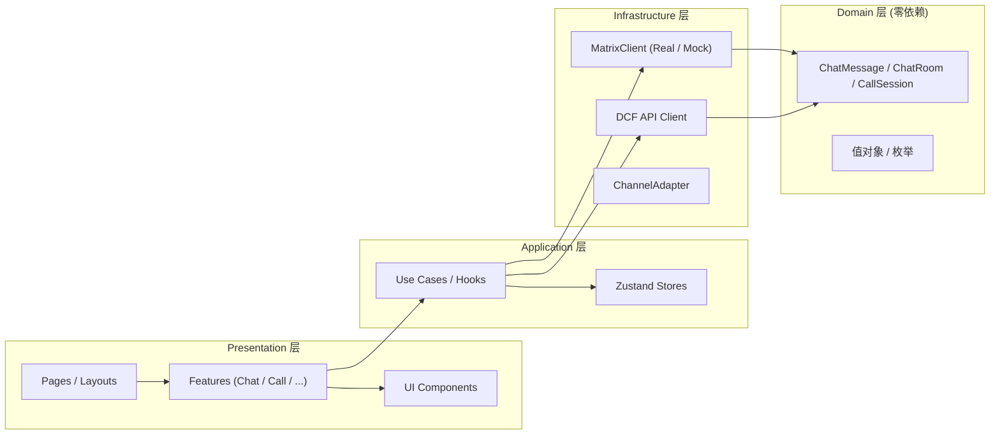

# DCF Client Suite

基于 React + TypeScript 的用户端 SPA，采用严格 DDD 四层架构。

## 架构



**依赖方向单向**：Presentation → Application → Infrastructure → Domain。禁止反向引用。

## 技术栈

| 项 | 选型 |
|----|------|
| 框架 | React 18 + TypeScript strict |
| 构建 | Vite |
| 样式 | Tailwind CSS 3.4 + `@dcf/ui-tokens` preset |
| 状态 | zustand（一 store 一文件） |
| IM | matrix-js-sdk（RealMatrixClient）+ MockMatrixClient（Demo） |
| 通话 | WebRTC via matrix-js-sdk VoIP |
| 测试 | vitest — 78 文件 621 测试 |
| 设计语言 | Apple HIG glass morphism，主色 `#007AFF` |

## 快速开始

```bash
cd client-suite
npm install
npm run dev:web              # http://127.0.0.1:5176/client-suite/
```

## 质量门禁

```bash
cd client-suite/apps/web
npx tsc --noEmit             # 类型检查
npx vitest run               # 测试
npx vite build               # 生产构建
```

## 目录结构

```
apps/web/src/
  domain/                    # 纯业务逻辑，零外部依赖
    chat/                    #   ChatMessage, ChatRoom
    call/                    #   CallSession
    shared/                  #   types, enums
  infrastructure/            # 外部适配器
    matrix/                  #   IMatrixClient, RealMatrixClient, MockMatrixClient
    api/                     #   DCF Backend API client
  application/               # 用例编排
    stores/                  #   authStore, chatStore, uiStore, callStore, ...
    hooks/                   #   useMatrixClient, useCall, ...
  presentation/              # React UI
    components/ui/           #   Avatar, Card, Icon, Lightbox, ...
    features/chat/           #   ChatPane, MessageBubble, ChatComposer, ...
    features/call/           #   CallOverlay, CallTimer
    layouts/                 #   Dock, Sidebar, Drawer
    pages/                   #   WorkspacePage, LoginPage
packages/ui-tokens/          # Tailwind 设计 Token preset
```
